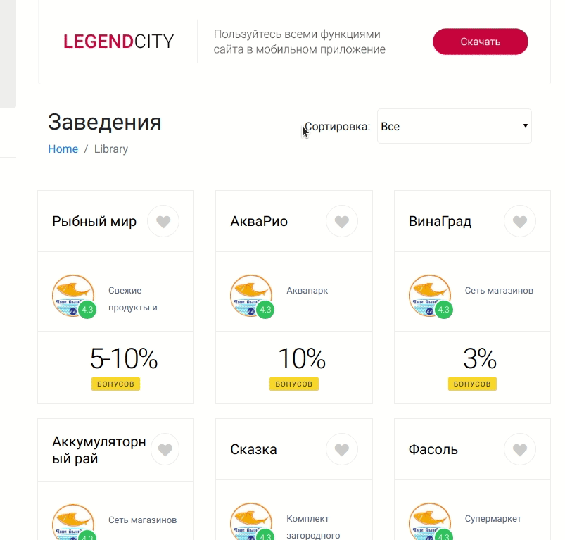

*React+Redux+TypeScript*

### Gif:


### Использование
- Приложение взаимодействует с локальным fake REST API `json-server`

1. Установить json-server
```
yarn add json-server 
```

2. Склонировать репозиторий и запустить 
```
- git clone https://github.com/Konstantin9595/legend-city

- cd legend-city/

- yarn install
```

3. Запустить json-server
```
json-server db.json --watch -p3001
```

4. Запустить приложение
```
yarn start

```

